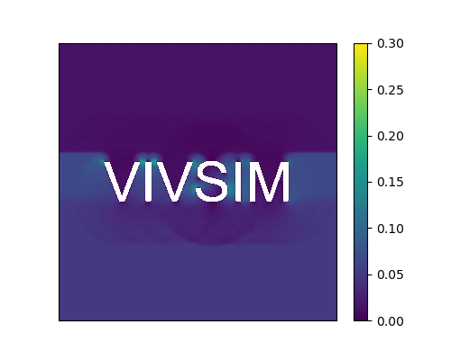

<p align="center">

</p>

# VIVSIM 

Accelerated vortex-induced vibration (VIV) simulation using immersed boundary lattice Boltzmann method (IB-LBM) powered by JAX.

## Examples

<p align="center">
    
</p>

> Velocity contour of lid-driven cavity at Re = 20000 with 1000x1000 cells (takes about 5 min on Nvidia Geforce 1080).

<p align="center">
    
</p>

> Velocity contour of flow over text-shaped obstacle.

<p align="center">
    
</p>

> A closed-up vortocity contour of VIV at Re = 1000 with 800x400 cells and 100 immersed boundary markers (takes about 1 min on Nvidia Geforce 1080).


## Capabilities

Lattice Models
- D2Q9
  
Collision Models
- Bhatnagar-Gross-Krook (BGK) model
- Multiple Relaxation Time (MRT) model

Boundary Conditions:
- Velocity boundary using Non-Equlibrium Bounce Back (Zou-He) method
- No slip boundary using Halfway Bounce-Back method
- Outlet boundary using no gradient method
- Periodic boundary

Fluid-Structure Interaction
- Multi Direct-Forcing Immersed Boundary method
- Confined Immersed Boundary technique to speed up VIV simulation

## Getting Started

To locally install for development:

```bash
git clone https://github.com/haimingz/vivsim.git
cd vivsim
pip install -r requirements.txt
pip install -e .
```

Please refer to https://github.com/google/jax for the latest installation documentation. 