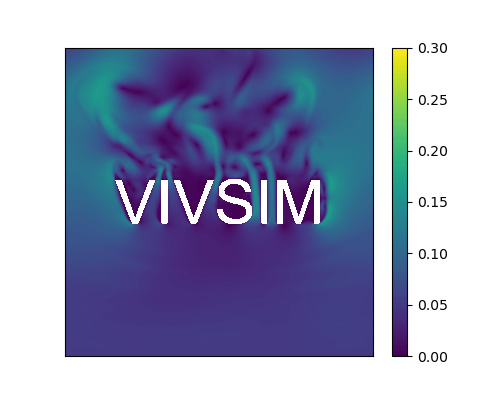

<p align="center">

</p>

# VIVSIM 

Accelerated vortex-induced vibration (VIV) simulation using immersed boundary lattice Boltzmann method (IB-LBM) powered by JAX.

## Examples

### Fluid flow without interaction with objects

<p align="center">
    
</p>

> Simulation of lid-driven cavity at Re = 20000 on a 1000x1000 lattice grid.

<p align="center">
    
</p>

> Simulation of flow pass through objects (texts) on a 1000x1000 lattice grid.

### Fluid-Structure Interaction (FSI)

<p align="center">
    
</p>

> Vorticity contour showing the VIV of a cylinder with Vr = 5 and Re = 1000. The simulation was conducted on a 800x400 lattice grid with 100 immersed boundary markers, taking about 1 min on Nvidia Geforce GTX 1080.

<p align="center">
    
</p>

> Velocity and vorticity contours showing the VIV of a cylinder with Vr = 5 and Re = 10000. The simulation was conducted on a 8000x4000 lattice grid with 1200 immersed boundary markers, taking about 30 min on 8 Nvidia A800.

## Capabilities

Lattice Models
- D2Q9
  
Collision Models
- Bhatnagar-Gross-Krook (BGK) model
- Multiple Relaxation Time (MRT) model

Boundary Conditions:
- Velocity boundary using Non-Equlibrium Bounce Back (Zou-He) method
- No slip boundary using Halfway Bounce-Back method
- Outlet boundary using no gradient method
- Periodic boundary

Fluid-Structure Interaction
- Multi Direct-Forcing Immersed Boundary method
- Confined Immersed Boundary technique to speed up VIV simulation

## Getting Started

To locally install for development:

```bash
git clone https://github.com/haimingz/vivsim.git
cd vivsim
pip install -r requirements.txt
pip install -e .
```

Please refer to https://jax.readthedocs.io/en/latest/installation.html for the latest installation documentation. 