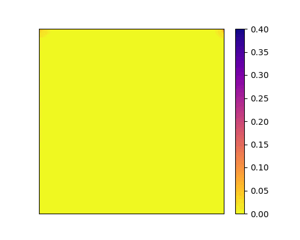
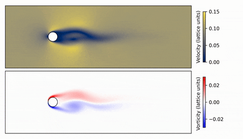
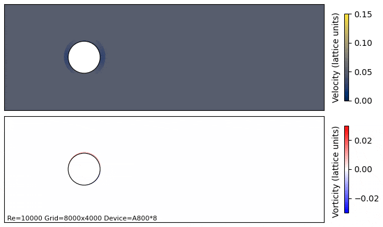
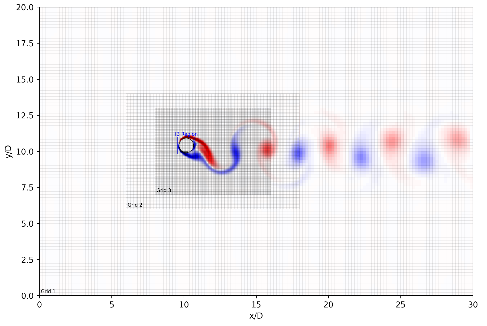

<br/>
<p align="center">
<br/><br/>
</p>

## VIVSIM 

[](https://github.com/MShawon/github-clone-count-badge) [](https://github.com/MShawon/github-clone-count-badge)


VIVSIM is a Python library for accelerated fluid-structure interaction (FSI) simulations based on the immersed boundary -lattice Boltzmann method (IB-LBM). It was originated from a research project requiring efficient simulation codes for studying vortex-induced vibration (VIV) of underwater structures. 

Inspired by projects like [JAX-CFD](https://github.com/google/jax-cfd) and [XLB](https://github.com/Autodesk/XLB), VIVSIM utilizes [JAX](https://github.com/jax-ml/jax) as the backend to harness the power of hardware accelerators, achieving massive parallelism on GPU/GPUs. 

VIVSIM is not a comprehensive, out-of-the-box tool. Instead, it provides a lean collection of **pure functions** for core IB-LBM computations. Users are expected to construct custom simulation models and computation routines for their exploration. Start with the included demo examples to see how easy that is!

## Examples

_Lid-driven cavity at Re = 2e4 on a 1000x1000 lattice grid_

  

_Flow passes some texts on a 1000x1000 lattice grid_

  

_VIV of a cylinder with U_r = 5 and Re = 1e2_

  

_VIV of a cylinder with U_r = 5 and Re = 1e4_

  

## Capabilities

Lattice Models
- D2Q9
  
Collision Models
- Single Relaxation Time (SRT) model
- Multiple Relaxation Time (MRT) model

Boundary Conditions:
- Velocity boundary using Non-Equilibrium Bounce Back (NEBB) method
- No-slip boundary using Halfway Bounce-Back method
- Outflow boundary simply by copying the second last column/row
- Outflow boundary by assigning equilibrium distribution values
- Periodic boundary

Fluid-Structure Interaction
- Multi Direct-Forcing Immersed Boundary method.

Acceleration techniques
- Multi-GPU simulation (using JAX)
- Gird refinement (shown below)
- Dynamic IB region (shown below)



## Todos

- Large-Eddy simulation
- 3D simulation capability


## Getting Started

To locally install VIVSIM for development:

```bash
git clone https://github.com/haimingz/vivsim.git
pip install -e vivsim
```
This package is based on JAX, whose installation may depend on the OS and hardware. If the above command does not work well, please refer to the [JAX Documentation](https://jax.readthedocs.io/en/latest/installation.html) for the latest installation guidance. 

More detailed instructions can be found in our [Documentation](https://github.com/haimingz/vivsim/wiki/Installation).

## Cite VIVSIM

If you find this repo useful, please cite [our paper](https://asmedigitalcollection.asme.org/OMAE/proceedings-abstract/OMAE2024/87844/1202724):
```
@inproceedings{zhu2024computational,
  title={Computational Performance of IB-LBM Based VIV Simulation Using Python With JAX},
  author={Zhu, Haiming and Du, Zunfeng and Yang, Yuan and Han, Muxuan},
  booktitle={International Conference on Offshore Mechanics and Arctic Engineering},
  volume={87844},
  pages={V006T08A020},
  year={2024},
  organization={American Society of Mechanical Engineers}
}
```

