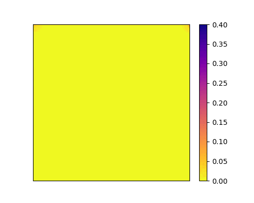
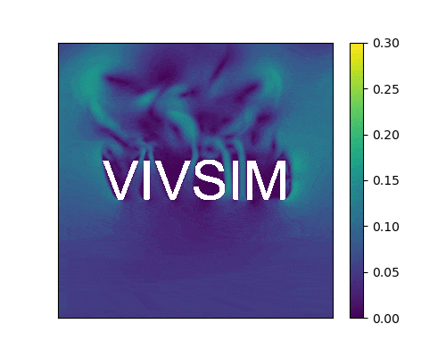
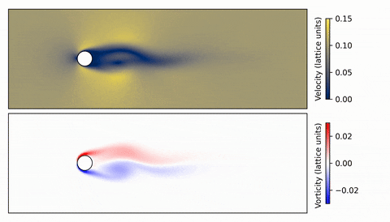
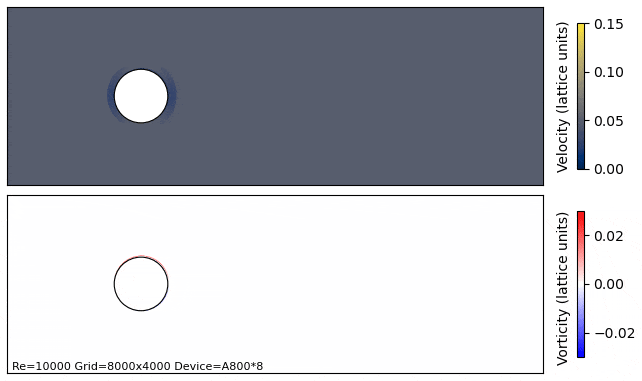
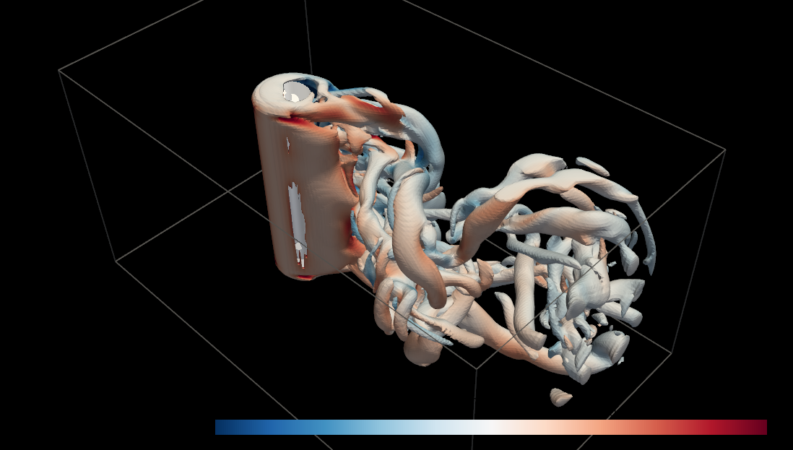

<br/>
<p align="center">
<br/><br/>
</p>

## VIVSIM 

[](https://github.com/MShawon/github-clone-count-badge) [](https://github.com/MShawon/github-clone-count-badge)


VIVSIM is a Python library for fluid-structure interaction (FSI) simulations based on the immersed boundary -lattice Boltzmann method (IB-LBM). It was originated from a research project requiring efficient simulation codes for studying vortex-induced vibration (VIV) of underwater structures. 

Inspired by projects like [JAX-CFD](https://github.com/google/jax-cfd) and [XLB](https://github.com/Autodesk/XLB), VIVSIM utilizes [JAX](https://github.com/jax-ml/jax) as the backend to achieve *hardware acceleration* and *automatic differentiation*. The project follows the **Functional Programming** paradigm to facilitate XLA compilation while making the codebase easier to understand and maintain.

## 2D Visuals

<div align="center">
  <table style="border: none; text-align: center;">
    <tr>
      <td></td>
      <td></td>
    </tr>
    <tr>
      <td><i>Lid-driven cavity at Re = 2e4 </i></td>
      <td><i>Flow passes some texts </i></td>
    </tr>
    <tr>
      <td></td>
      <td></td>
    </tr>
    <tr>
      <td><i>VIV of a cylinder, U_r = 5, Re = 1e2</i></td>
      <td><i>VIV of a cylinder, U_r = 5, Re = 1e4</i></td>
    </tr>
  </table>
</div>

## 3D Visuals

<div align="center">
  <table style="border: none; text-align: center;">
    <tr>
      <td></td>
      <td>
        <video src="assets/3dsphere.mp4" controls width="360" aria-label="Three-dimensional flow past an immersed sphere"></video>
      </td>
    <tr>
      <td><i>VIV of a cylinder</i></td>
      <td><i>Flow past an immersed sphere</i></td>
    </tr>
    </tr>
  </table>
</div>

## Installation

To locally install VIVSIM for development:

```bash
git clone https://github.com/haimingz/vivsim.git
cd vivsim
pip install -e ".[cpu]"
```

JAX installation depends on the operating system and accelerator backend. VIVSIM now exposes the most common JAX choices as optional extras:

```bash
# CPU-only development on Linux/macOS/Windows
pip install -e ".[cpu]"

# NVIDIA GPU on Linux
pip install -e ".[cuda12]"
pip install -e ".[cuda13]"

# Google Cloud TPU
pip install -e ".[tpu]"
```

## Usage

VIVSIM provides a collection of **pure functions** for IB-LBM computations. Users can construct custom simulation models for different tasks. Start with the included demo examples to see how easy that is! Below is a minimum workable example for lid-driven cavity simulation:

```python
import jax
import jax.numpy as jnp
from vivsim import lbm

# define constants
NX = 100  # grid size in x direction
NY = 100  # grid size in y direction
TM = 1000  # number of time steps
U0 = 0.5  # velocity of lid
NU = 0.1  # kinematic viscosity

OMEGA = lbm.get_omega(NU)  # relaxation parameter

# define fluid properties
rho = jnp.ones((NX, NY), dtype=jnp.float32)      # density
u = jnp.zeros((2, NX, NY), dtype=jnp.float32)    # velocity

# initialize distribution function
f = lbm.get_equilibrium(rho, u)

# define compute routine
@jax.jit
def update(f):
    
    # Collision
    rho, u = lbm.get_macroscopic(f)
    feq = lbm.get_equilibrium(rho, u)
    f = lbm.collision_bgk(f, feq, OMEGA)

    # Streaming
    f = lbm.streaming(f)

    # Boundary conditions
    f = lbm.boundary_nee(f, loc='left')
    f = lbm.boundary_nee(f, loc='right')
    f = lbm.boundary_nee(f, loc='bottom')
    f = lbm.boundary_nee(f, loc='top', ux_wall=U0)
    
    return f

# start simulation
for t in range(TM):   
    f  = update(f)

    # export data & visualization ...

```

## Implemented Methods

Lattice Models
- D2Q9
- D3Q19
  
Collision Models
- Bhatnagar-Gross-Krook (BGK) collision operator
- Multiple Relaxation Time (MRT) collision operator
- Karlin–Bösch–Chikatamarla (KBC) collision operator
- Regularized collision operator

Boundary Conditions:
- Predescribed velocity, density, and forces at boundaies using: 
  - Non-Equilibrium Bounce Back (NEBB) method
  - Non-Equilibrium Extrapolation (NEE) method
  - Equilibrium boundary
- Predescribed velocity boundary using
  - Bounce-Back method (no-slip)
  - Specular Reflection (slip)
- Periodic boundary

Forcing Schemes:
- Guo's Forcing scheme
- Modified Exact Difference Method (EDM)

Immersed Boundary Methods:
- Peskin's 2-, 3- and 4-point kernels
- 4-point cosine kernel
- Multi-Direct-Forcing (MDF) method.

## Benchmark 

Here is a performance snippet showing the average execution time for core JAX-compiled pure functions on a Nvidia RTX4090 GPU. You can generate similar benchmarks on your hardware by running `python examples/benchmark.py`.

```
Benchmarking on cuda:0 | grid: 1024x1024 | markers: 512 | repeats: 200

Function                             Time (us)  Bar
--------------------------------------------------------------------------------
lbm.get_macroscopic                      0.619  
lbm.get_equilibrium                      0.296  
lbm.streaming                           71.214  ==
lbm.collision_bgk                       36.594  =
lbm.collision_kbc                      348.668  ==============
lbm.collision_mrt                      476.972  ====================
lbm.collision_reg                      196.233  ========
lbm.forcing_edm                         79.364  ===
lbm.forcing_guo_bgk                     56.261  ==
lbm.forcing_guo_mrt                    204.868  ========
lbm.get_guo_forcing_term                 0.706  
lbm.boundary_nee                         7.238  
lbm.boundary_velocity_nee                6.573  
lbm.boundary_pressure_nee                6.961  
lbm.boundary_nebb                        6.481  
lbm.boundary_velocity_nebb               6.807  
lbm.boundary_pressure_nebb               6.537  
lbm.boundary_equilibrium                 3.361  
lbm.boundary_bounce_back                38.752  =
lbm.boundary_specular_reflection        39.087  =
lbm.obstacle_bounce_back                 0.650  
lbm.boundary_characteristic              0.292  
ib.get_area                              0.721  
ib.get_ds_closed                         0.807  
ib.get_ds_open                           0.979  
ib.kernel_peskin_3pt                     3.503  
ib.kernel_peskin_4pt                     3.004  
ib.kernel_cosine_4pt                     3.211  
ib.get_ib_stencil                        0.635  
ib.interpolate                           0.735  
ib.spread                                1.002  
ib.multi_direct_forcing                  0.923  
--------------------------------------------------------------------------------
```
If you have suggestions for improving the performance of any function, please feel free to open an issue or submit a pull request!


## Cite VIVSIM

If you find this repo useful, please cite [our paper](https://asmedigitalcollection.asme.org/OMAE/proceedings-abstract/OMAE2024/87844/1202724):
```
@article{zhu2025gpu,
  title={{GPU} Accelerated Vortex-Induced Vibration Simulation Using {JAX}: Efficiency and Accuracy Strategies},
  author={Zhu, Haiming and Yang, Yuan and Du, Zunfeng and Yu, Jianxing},
  journal={Computers \& Fluids},
  pages={106913},
  year={2025},
  publisher={Elsevier}
}
```
