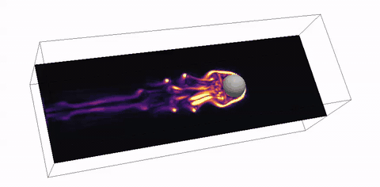

<br/>
<p align="center">
<br/><br/>
</p>

## VIVSIM 

[](https://github.com/MShawon/github-clone-count-badge) [](https://github.com/MShawon/github-clone-count-badge)


VIVSIM is a Python library for fluid-structure interaction (FSI) simulations based on the immersed boundary -lattice Boltzmann method (IB-LBM). It was originated from a research project requiring efficient simulation codes for studying vortex-induced vibration (VIV) of underwater structures. 

Inspired by projects like [JAX-CFD](https://github.com/google/jax-cfd) and [XLB](https://github.com/Autodesk/XLB), VIVSIM utilizes [JAX](https://github.com/jax-ml/jax) as the backend to achieve *hardware acceleration* and *automatic differentiation*. The project follows the **Functional Programming** paradigm to facilitate XLA compilation while making the codebase easier to understand and maintain.

## Examples

<div align="center">
  <table style="border: none; text-align: center;">
    <tr>
      <td></td>
      <td></td>
    </tr>
    <tr>
      <td><i>Lid-driven cavity at Re = 2e4 </i></td>
      <td><i>Flow passes some texts </i></td>
    </tr>
    <tr>
      <td></td>
      <td></td>
    </tr>
    <tr>
      <td><i>VIV of a cylinder, U_r = 5, Re = 1e2</i></td>
      <td><i>VIV of a cylinder, U_r = 5, Re = 1e4</i></td>
    </tr>
    <tr>
      <td></td>
      <td>
        </img>
      </td>
    </tr>
    <tr>
      <td><i>VIV of a cylinder</i></td>
      <td><i>Flow past an immersed sphere</i></td>
    </tr>
  </table>
</div>

## Installation

To locally install VIVSIM for development without selecting a JAX backend:

```bash
git clone https://github.com/haimingz/vivsim.git
cd vivsim
pip install -e .
```

Installing with no extra flag (`pip install -e .`) installs VIVSIM and its
non-JAX dependencies only. It does not install, upgrade, downgrade, or otherwise
modify JAX. This is the recommended option when JAX is already installed in the
environment, for example when using a cluster-managed JAX module, a custom CUDA
wheel, or another project that controls the JAX version.

JAX installation depends on the operating system and accelerator backend. If you
want VIVSIM to install JAX for you, use one of the optional extras:

```bash
# CPU-only development on Linux/macOS/Windows
pip install -e ".[cpu]"

# NVIDIA GPU on Linux
pip install -e ".[cuda12]"
pip install -e ".[cuda13]"

# Google Cloud TPU
pip install -e ".[tpu]"
```

## Usage

VIVSIM provides a collection of **pure functions** for IB-LBM computations. Users can construct custom simulation models for different tasks. Start with the included demo examples to see how easy that is! Below is a minimum workable example for lid-driven cavity simulation:

```python
import jax
import jax.numpy as jnp
from vivsim import lbm

# define constants
NX = 100  # grid size in x direction
NY = 100  # grid size in y direction
TM = 1000  # number of time steps
U0 = 0.5  # velocity of lid
NU = 0.1  # kinematic viscosity

OMEGA = lbm.get_omega(NU)  # relaxation parameter

# define fluid properties
rho = jnp.ones((NX, NY), dtype=jnp.float32)      # density
u = jnp.zeros((2, NX, NY), dtype=jnp.float32)    # velocity

# initialize distribution function
f = lbm.get_equilibrium(rho, u)

# define compute routine
@jax.jit
def update(f):
    
    # Collision
    rho, u = lbm.get_macroscopic(f)
    feq = lbm.get_equilibrium(rho, u)
    f = lbm.collision_bgk(f, feq, OMEGA)

    # Streaming
    f = lbm.streaming(f)

    # Boundary conditions
    f = lbm.boundary_nee(f, loc='left')
    f = lbm.boundary_nee(f, loc='right')
    f = lbm.boundary_nee(f, loc='bottom')
    f = lbm.boundary_nee(f, loc='top', ux_wall=U0)
    
    return f

# start simulation
for t in range(TM):   
    f  = update(f)

    # export data & visualization ...

```

## Implemented Methods

Lattice Models
- D2Q9
- D3Q19
  
Collision Models
- Bhatnagar-Gross-Krook (BGK) collision operator
- Multiple Relaxation Time (MRT) collision operator
- Karlin–Bösch–Chikatamarla (KBC) collision operator
- Regularized collision operator

Boundary Conditions:
- Predescribed velocity, density, and forces at boundaies using: 
  - Non-Equilibrium Bounce Back (NEBB) method
  - Non-Equilibrium Extrapolation (NEE) method
  - Equilibrium boundary
- Predescribed velocity boundary using
  - Bounce-Back method (no-slip)
  - Specular Reflection (slip)
- Periodic boundary

Forcing Schemes:
- Guo's Forcing scheme
- Modified Exact Difference Method (EDM)

Immersed Boundary Methods:
- Peskin's 2-, 3- and 4-point kernels
- 4-point cosine kernel
- Multi-Direct-Forcing (MDF) method.

## Benchmark 

Here is a performance snippet showing the average execution time for core JAX-compiled pure functions on a Nvidia RTX4090 GPU. You can generate similar benchmarks on your hardware by running `python examples/benchmark.py` and `python examples/benchmark3d.py`.

```
Benchmarking on cuda:0 | grid: 1024x1024 | markers: 512 | repeats: 200

Function                             Time (us)  Bar
--------------------------------------------------------------------------------
lbm.get_macroscopic                     34.751  ===
lbm.get_equilibrium                     43.933  ====
lbm.streaming                           72.021  =======
lbm.collision_bgk                       46.804  ====
lbm.collision_kbc                      178.789  =================
lbm.collision_mrt                      203.575  ====================
lbm.collision_reg                      109.997  ==========
lbm.forcing_edm                         43.279  ====
lbm.forcing_guo_bgk                     46.363  ====
lbm.forcing_guo_mrt                    152.419  ==============
lbm.get_guo_forcing_term                49.493  ====
lbm.boundary_nee                         6.479  
lbm.boundary_velocity_nee                6.866  
lbm.boundary_pressure_nee                6.566  
lbm.boundary_nebb                        6.805  
lbm.boundary_velocity_nebb               6.121  
lbm.boundary_pressure_nebb               6.597  
lbm.boundary_equilibrium                 3.370  
lbm.boundary_bounce_back                45.107  ====
lbm.boundary_specular_reflection        42.676  ====
lbm.obstacle_bounce_back                 1.103  
lbm.boundary_characteristic             12.810  =
ib.get_area                             12.646  =
ib.get_ds (closed)                      17.055  =
ib.get_ds (open)                        12.256  =
ib.kernel_peskin_3pt                     3.141  
ib.kernel_peskin_4pt                     3.195  
ib.kernel_cosine_4pt                     3.243  
ib.get_ib_stencil                       20.201  =
ib.interpolate                          28.098  ==
ib.spread                               20.458  ==
ib.multi_direct_forcing                 71.255  =======
--------------------------------------------------------------------------------
Functions count                             32
```

```
Benchmarking on cuda:0 | grid: 128x128x128 | markers: 2562 | repeats: 50

Function                                Time (us)  Bar
-----------------------------------------------------------------------------------
lbm3d.get_macroscopic                     466.595  ===
lbm3d.get_equilibrium                     685.602  ====
lbm3d.streaming                           806.904  =====
lbm3d.collision_bgk                       625.101  ====
lbm3d.collision_kbc                      2884.170  ====================
lbm3d.collision_mrt                      1188.563  ========
lbm3d.collision_reg                      1546.651  ==========
lbm3d.forcing_edm                         602.678  ====
lbm3d.forcing_guo_bgk                     605.084  ====
lbm3d.forcing_guo_mrt                     970.082  ======
lbm3d.get_guo_forcing_term                358.123  ==
lbm3d.boundary_nee                         26.266  
lbm3d.boundary_velocity_nee                29.480  
lbm3d.boundary_pressure_nee                36.615  
lbm3d.boundary_nebb                        15.011  
lbm3d.boundary_velocity_nebb               15.279  
lbm3d.boundary_pressure_nebb               28.991  
lbm3d.boundary_equilibrium                 15.769  
lbm3d.boundary_bounce_back                385.016  ==
lbm3d.boundary_specular_reflection        388.708  ==
lbm3d.obstacle_bounce_back                  9.113  
lbm3d.boundary_characteristic              15.910  
ib3d.get_triangle_areas                    17.877  
ib3d.get_surface_area                      24.117  
ib3d.get_volume                            14.897  
ib3d.get_ds                                12.351  
ib3d.kernel_peskin_3pt                      4.821  
ib3d.kernel_peskin_4pt                      4.133  
ib3d.kernel_cosine_4pt                      6.124  
ib3d.get_ib_stencil                        12.818  
ib3d.interpolate                           14.409  
ib3d.spread                                63.082  
ib3d.multi_direct_forcing                 184.875  =
-----------------------------------------------------------------------------------
Functions count                                33
```

If you have suggestions for improving the performance of any function, please feel free to open an issue or submit a pull request!


## Cite VIVSIM

If you find this repo useful, please cite [our paper](https://asmedigitalcollection.asme.org/OMAE/proceedings-abstract/OMAE2024/87844/1202724):
```
@article{zhu2025gpu,
  title={{GPU} Accelerated Vortex-Induced Vibration Simulation Using {JAX}: Efficiency and Accuracy Strategies},
  author={Zhu, Haiming and Yang, Yuan and Du, Zunfeng and Yu, Jianxing},
  journal={Computers \& Fluids},
  pages={106913},
  year={2025},
  publisher={Elsevier}
}
```
